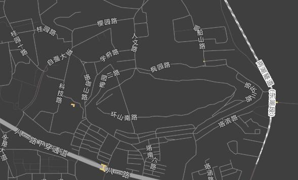

# LineStringLayer

LineStringLayer is a layer for rendering line data based on WebGL graphics technology. LineStringLayer uses the same rendering logic as [VectorTileLayer](/en/api/vector-tile-layer) and shares the same Symbol styles.

LineStringLayer is used exactly like [VectorLayer](https://maptalks.org/maptalks.js/api/0.x/VectorLayer.html) in the core maptalks library, but benefits from WebGL technology for significantly better performance.

LineStringLayer only supports adding [LineString](https://maptalks.org/maptalks.js/api/0.x/LineString.html) and [MultiLineString](https://maptalks.org/maptalks.js/api/0.x/MultiLineString.html). Adding other data will raise an error.

LineStringLayer supports all marker, text and line styles of the Symbol styles. The marker and text styles are mainly used to draw icons at specified positions such as line endpoints or mid-segments, or text along the line.



It is an indirect subclass of [maptalks.OverlayLayer](https://maptalks.org/maptalks.js/api/0.x/OverlayLayer.html) (directly inheriting from Vector3DLayer) and inherits all methods of Vector3DLayer.

> [!INFO]
> By default, LineStringLayer assembles all LineStrings into a single 3D Mesh for rendering. Updating some Marker-related styles causes the layer to rebuild the Mesh, and frequent operations may cause performance issues. See the [performance optimization for vector layers](/en/api/vt-performance) document for details.

## Constructor

```js
import { LineStringLayer } from '@maptalks/gl-layers';

const layer = new LineStringLayer('line0');
```
<details><summary>Details</summary>
<div>
Parameters:

* id\* **String** the layer id
* options\* **Object** options, the available options are as follows:

| Option | Type | Description | Default |
|  ------             | :----:  | ----                      |   :-----------:  |
|meshRenderOrder      | Number  | The mesh render order (overrides the base class default of 0 to keep lines on top of other objects) | 1 |
<!--@include: ./includes/vector3d-layer-options.md-->
<!--@include: ./includes/layer-options.md-->

</div>
</details>

## Methods

<details><summary>identify(coordinate, options)</summary>
<div>
<br/>

Queries features at the given coordinate on the layer (only rendered data can be queried).

```js
layer.identify([121.23, 39.34], { tolerance: 2 });
```

Parameters:

* coordinate **Number[]** the coordinate value
* options **Object** options, the possible properties are:
| Property | Type | Description | Default |
|  ------      | :----:  | ----  |   :-----------:  |
| tolerance    | Number  | The pixel tolerance for the query | 3 |

Returns:

* Geometry[]

</div>
</details>

<details><summary>identifyAtPoint(containerPoint, options)</summary>
<div>
<br/>

Queries features at the given container point on the layer.

```js
layer.identifyAtPoint([400, 300], { tolerance: 2 });
```

Parameters:

* containerPoint **Number[]** container coordinates (screen pixels)
* options **Object** options, the possible properties are:
| Property | Type | Description | Default |
|  ------      | :----:  | ----  |   :-----------:  |
| tolerance    | Number  | The pixel tolerance for the query | 3 |

Returns:

* Object[]

</div>
</details>

<!-- api-gen:start -->
### Other Public Methods of LineStringLayer

<!--@include: ./includes/api/line-string-layer-missing.md-->

### Methods Inherited from Vector3DLayer

The following methods are provided by the parent class Vector3DLayer and are available on instances of this class.

<!--@include: ./includes/api/vector3-d-layer-methods.md-->

### Methods Inherited from OverlayLayer

The following methods are provided by the parent class [OverlayLayer](/en/api/overlay-layer) and are available on instances of this class.

<!--@include: ./includes/api/overlay-layer-methods.md-->

### Methods Inherited from Layer

The following methods are provided by the parent class [Layer](/en/api/layer) and are available on instances of this class.

<!--@include: ./includes/api/layer-methods.md-->

### Mixed-in Methods

This class gains the following method groups from mixins; see the linked pages for details: [JSONAble](/en/api/json-able)（`getJSONType`…）；[Eventable](/en/api/eventable)（`on`、`addEventListener`、`once`、`off`、`removeEventListener`、`listens`、`getListeningEvents`、`copyEventListeners`…）；[Renderable](/en/api/renderable).
<!-- api-gen:end -->

## Static Methods

<details><summary>fromJSON(json)</summary>
<div>
<br/>

Creates a LineStringLayer object from the layer's JSON object.

```js
const json = layer.toJSON();

const layerCopied = maptalks.Layer.fromJSON(json);
```

Returns:

* LineStringLayer

</div>
</details>

<!-- api-gen:start -->
### Other Static Methods of LineStringLayer

<!--@include: ./includes/api/line-string-layer-statics-missing.md-->

### Static Methods Inherited from Vector3DLayer

The following methods are provided by the parent class Vector3DLayer and are available on instances of this class.

<!--@include: ./includes/api/vector3-d-layer-statics.md-->

### Static Methods Inherited from Layer

The following methods are provided by the parent class [Layer](/en/api/layer) and are available on instances of this class.

<!--@include: ./includes/api/layer-statics.md-->
<!-- api-gen:end -->

## Events

<!--@include: ./includes/js-events-example.md-->

> Note: The renderer also fires rendering events such as `buildlinemesh`, `updatemesh`, `partialupdate`, `removegeo`, and `iblupdated` (verified in 2026).

> This document has been cross-checked against the @maptalks/gl-layers 2026 source code (api-notes-vt-gl.md)

<!-- api-gen:start -->
### Events Inherited from OverlayLayer

<!--@include: ./includes/api/overlay-layer-events.md-->

### Events Inherited from Layer

<!--@include: ./includes/api/layer-events.md-->
<!-- api-gen:end -->
