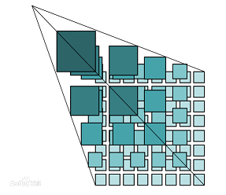
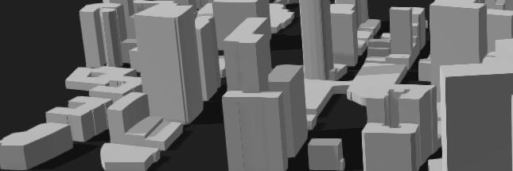

# Overview

## Map Tiles

The tile map pyramid model is a multi-resolution hierarchical model. From the bottom to the top of the tile pyramid, the resolution decreases while the geographic extent remains the same. First, determine the number of zoom levels N that the map service platform provides. Take the map image with the highest zoom level and the largest map scale as the bottom of the pyramid (level 0), and tile it: starting from the upper-left corner of the map image, cut it from left to right and top to bottom into square map tiles of the same size (e.g. 256x256 pixels), forming the level-0 tile matrix. Based on the level-0 map image, generate the level-1 map image by splitting every pixel into 2x2 pixels, and tile it into square map tiles of the same size as the previous level, forming the level-1 tile matrix. Generate the level-2 tile matrix in the same way, and so on, up to level N-1, to form the entire tile pyramid.

> Quoted from Baidu Baike.

## Raster Tiles and Vector Tiles

* Raster tiles are tiles whose content is a static image, such as png, jpg, etc.
* Vector tiles are tiles whose content is vector data, including the coordinates of points, lines and polygons and optional data property values. Here is a [brief introduction to vector tiles](/en/guide/vector-tile).

| Feature | Raster Tiles | Vector Tiles |
|:------------ | -----------| --------|
|Easy to produce |  ❌        | ✔     |
|Attribute data |  ❌        | ✔     |
|Interactive   |  ❌        | ✔     |
|3D support    |  ❌        | ✔     |
|Rendering mechanism |  Simple | Complex |
|Real-time tiling |  Difficult | Easy |

In summary, compared with traditional raster tiles, vector tiles have many advantages apart from a more complex rendering mechanism.

## History

The vector tile format was developed by Mapbox in 2014. The latest version is 2.1.

## Vector Tiles and 3D

Vector tiles currently store 2D data, but by combining the height values in the attribute data, 3D white-model buildings like those in the image below can be generated.

## Server-Side Real-Time Tiling

Because vector tiles store vector data, they can skip the server-side rendering step required by raster tiles, so generating vector tiles in real time from a spatial database is more efficient and convenient.

With server-side real-time tiling, data updates are reflected in the tiles in real time, improving the real-time responsiveness of the service and reducing data maintenance costs.

PostGIS now provides the `ST_AsMVT` SQL function, which can output query results directly in the vector tile format. Some open-source servers in the community offer real-time tiling based on database or file data.

The MapTalks solution provides the VTS server software for real-time vector tile tiling of data at the scale of hundreds of millions of records. You can find detailed information here.

> This document has been cross-checked against the @maptalks/gl-layers 2026 source code (api-notes-vt-gl.md)
