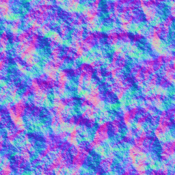

# water render plugin

A render plugin that renders polygon data with a realistic water effect.

## Configuration
```js
{
  renderPlugin: {
    // [必填] 固定为water
    type: 'water',
    // [必填] 数据生成设置
    dataConfig: {
      // [必填]，数据类型，固定为fill
      type: "fill"
    }
  },
  filter: true,
  symbol: {
    // [可选] 默认为false
    // 是否开启ssr后处理
    ssr: false,
    // [必填] 默认为null
    // 水波法线纹理。
    texWaveNormal: 'path/to/texWaveNormal.png',
    // [必填] 默认为null
    // 水波扰动纹理。
    texWavePerturbation: 'path/to/texWavePerturbation.png',
    // [可选] 默认为0
    // 水体流向方向，取值范围，0-360，单位度
    waterDirection: 0,
    // [可选] 默认为 [0.1451, 0.2588, 0.4863, 1]
    // 水体基础色，归一化的4位数组
    waterBaseColor: [0.1451, 0.2588, 0.4863, 1],
    // [可选] 默认为false
    // 是否开启动画
    animation: true
  }
}
```

For more on the filter data filtering conditions, see [feature-filter](/en/guide/style/feature-filter).

## Supported data types

<!--@include: ./includes/fill-supports.md-->

## Dynamic styles

The symbol properties of the water render plugin do not support dynamic styles.

## Supported Symbol style properties

-----------
### ssr

Default: false

**Boolean** — whether to enable the SSR (screen-space reflections) post-processing effect.

-----------
### texWaveNormal

Default: null

**String** — the wave normal texture. The wave normal texture used in the IDE is:



-----------
### texWavePerturbation

Default: null

**String** — the wave perturbation texture. The wave perturbation texture used in the IDE is:


-----------
### waterDirection

Default: 0

**Number** — the water flow direction, range 0-360, in degrees.

-----------
### waterBaseColor

Default: [0.1451, 0.2588, 0.4863, 1]

**Number[]** — the water color, a normalized four-element array.

-----------
### animation

Default: false

**Boolean** — whether to enable the water animation (in the 2026 source code WaterPainter, the animation is not enabled when symbol.animation is absent; the old documentation wrote true).

-----------
### contrast

Default: 1

**Number** — the contrast of the water color.

-----------
### hsv

Default: [0, 0, 0]

**Number[]** — the HSV color adjustment of the water surface; the three values are hue, saturation and value.

-----------
### uvScale

Default: 3

**Number** — the UV scale of the wave normal texture (number of repeats).

-----------
### waterSpeed

Default: 1

**Number** — the water flow speed, used together with animation; the larger the value, the faster the flow.

> This document has been cross-checked against the @maptalks/gl-layers 2026 source code (api-notes-vt-gl.md)
